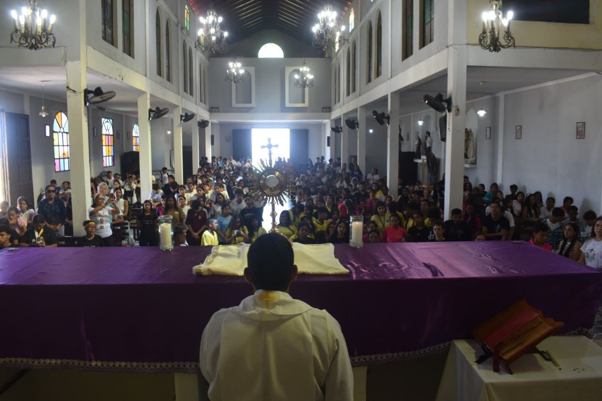

El evento Level Up, celebrado el pasado 28 de febrero en las instalaciones del Colegio Juan Pablo II de La Aviación, logró concentrar a más de 200 jóvenes de las distintas parroquias de la Diócesis de La Guaira. El encuentro, que buscaba celebrar la jornada de la juventud, superó las expectativas tanto de asistencia como de tiempo y cerró sus puertas a las 3:30 p. m. tras una agenda que integró desde la espiritualidad de Hakuna (movimiento católico juvenil) hasta la intensidad de un rally deportivo.

La jornada arrancó a las 9:00 a. m. con una Hora Santa al estilo Hakuna, marcando un inicio introspectivo que rápidamente dio paso a la acción física con torneos de fútbol, voleibol y kickingball. Gracias a una esmerada campaña en redes sociales de la Pastoral Juvenil, la Curia y colegios parroquiales, el evento se perfiló como el *boom* del mes para la juventud católica guaireña.

Detrás de la potencia del evento estuvo Enrique Pinto, responsable de todo el equipo de sonido, cuya gestión fue clave para mantener el ritmo de los recitales y las dinámicas. La logística también fue rigurosa, las cartas de solicitud para el préstamo de equipos y espacios fueron la base legal que permitió el despliegue en el colegio.

> El objetivo era conectar las parroquias y lo logramos, aunque la dinámica propia de los jóvenes extendió la jornada más allá de lo previsto.

Desde la organización, el equipo estratégico, liderado por Ana Hernández como Coordinadora de la Pastoral Juvenil del Estado, junto a Samuel Medina en la Secretaría, Valeria Camacho en Redes Sociales y el Padre Onorio Herrera como asesor, logró una convocatoria orgánica que llenó las expectativas. "El objetivo era conectar las parroquias y lo logramos", mencionó Ana Hernandez. "Aunque la dinámica propia de los jóvenes extendió la jornada más allá de lo previsto".

La plaza de ventas fue el punto de encuentro social. Betsabe Acosta, coordinadora del grupo juvenil de la Catedral de La Guaira, organizó una vendimia de tortas y café que sirvió para recolectar fondos para el próximo Encuentro Nacional de los Jóvenes (ENAJO) y próximas actividades del grupo.

Sin embargo, el punto a tener en cuenta fue la alimentación, ya que, aunque la Pastoral Juvenil ofreció una sopa gratuita para los 200 inscritos, la falta de variedad en la oferta gastronómica generó un cuello de botella para la logística del proceso. Debido a esto, decenas de jóvenes se vieron obligados a cruzar la avenida principal de La Aviación para buscar alternativas.

<DoubleImage 
  src1="../../assets/images/notas/level-up-espiritual/3.jpg" 
  alt1="Joven salta en carrera de sacos mientras es animada por otros jóvenes y niños" 
  src2="../../assets/images/notas/level-up-espiritual/4.jpg" 
  alt2="Grupo de jóvenes organizados en fila participando en un juego con pelotas pequeñas"
/>

El Level Up fue un espacio donde la oración y el deporte convergieron. Con el respaldo de la Curia y el esfuerzo de los coordinadores parroquiales, el evento cerró con rostros cansados pero satisfechos.