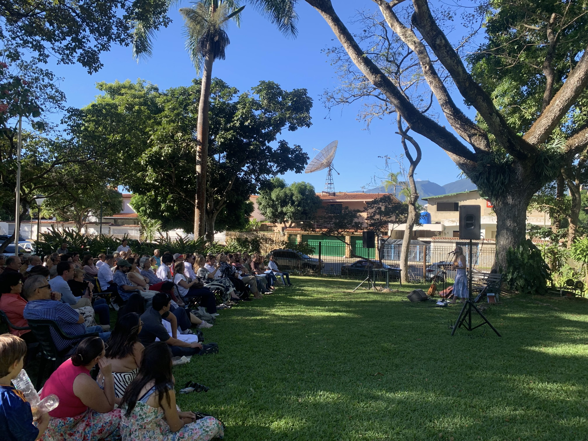

El día domingo 18 de enero de 2026, la cantante y compositora Maya Von se presentó en la Hacienda La Trinidad Parque Cultural, bajo un clima completamente soleado que fue de buena combinación con su música, en un formato de taquilla inversa, por lo que cualquiera estaba invitado a asistir y aportar si lo deseaba al final del concierto.

Una hora antes de la convocada, a las 2:00 p.m., la cantante, junto a una compañera, se encontraba ensayando y haciendo pruebas de sonido. Varias sillas estaban instaladas en el jardín al frente del famoso del recinto, pero iban a ser insuficientes para la cantidad de personas que llegaron después, ya que hubo una cantidad de asistentes que se tuvieron que sentar en la grama del espacio.

<DoubleImage 
  src1="../../assets/images/notas/maya-von-presentacion-en-la-trinidad/2.jpg" 
  alt1="Escenario para la presentación" 
  src2="../../assets/images/notas/maya-von-presentacion-en-la-trinidad/3.jpg" 
  alt2="Clima soleado"
/>

A las 3:05 p.m. el concierto daría comienzo luego de que un integrante del equipo de la cantante hiciera la presentación. Ella apareció con vestido azul, el cual resaltó al final. Comenzó su repertorio interpretando la canción Aquí y Ahora.

Luego de esto, cada canción que tocó fue brevemente explicada por la cantante. La recopilación interpretada estuvo integrada por canciones conocidas, otras que nacieron por tendencias de redes sociales, como la interpretación en alemán de El Burrito Sabanero, y otras que aún no han sido publicadas, las cuales formarán parte de su tercer disco, adelantó la compositora.

El concierto fue natural en todos los sentidos, tanto por el entorno como por la interpretación, de la cual, en ocasión de dos canciones del principio, tuvieron que ser repetidas luego de haber iniciado por unos segundos.

> Llega un momento en el que uno conecta con la persona. La sientes como tu amiga.

Entre el público, que contaba entre jóvenes y mayores, no faltaron las lágrimas, sobre todo en la interpretación de la canción que lleva como título ese término, y la cual trata del añorar a la madre cuando se está muy lejos de ella. “Llega un momento en el que uno conecta con la persona”, dijo  el asistente Andrés Solorzano, como respuesta a la pregunta de por qué sigue escuchando a Maya Von. “La sientes como tu amiga”.

La cantante declaró haber estado sumamente nerviosa porque poco tiempo antes tenía gripe y le costaba llegar a los tonos altos. “Toda la semana estuve con un teipe en la boca”, dijo. Aún así, al final ella sintió haberlo hecho bien y que el universo y los dioses la ayudaron.

El próximo paso de la artista es la búsqueda de fondos para la grabación de su tercer álbum, del cual ya tiene todas las canciones escritas y le hace falta la producción, tal como informó. “Enseñarle a la gente que puedo crear estos espacios alegres y de alta vibración con música y que, si sigo haciendo música, podré repetirlo”, indicó Maya Von como el objetivo de este concierto.
